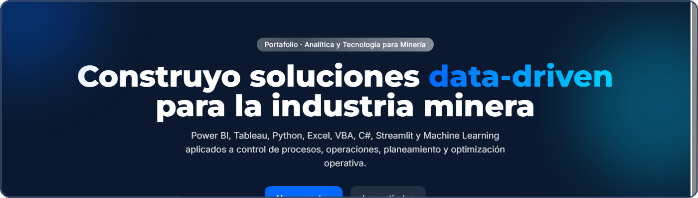
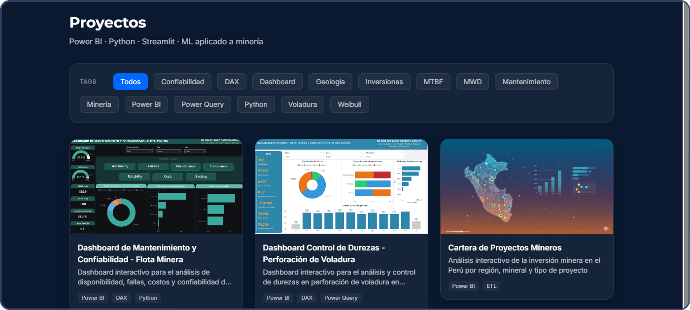
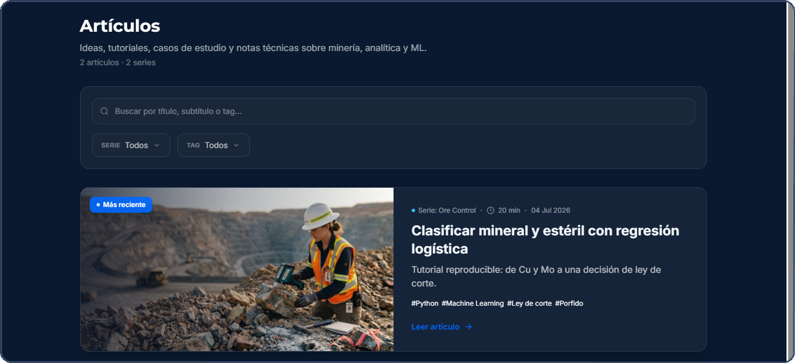
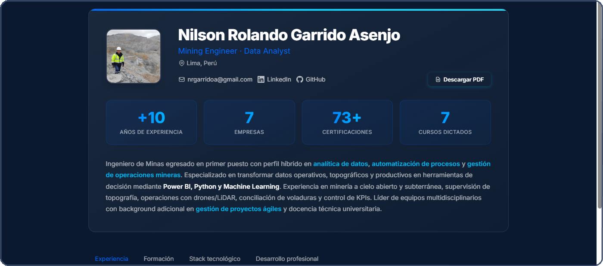
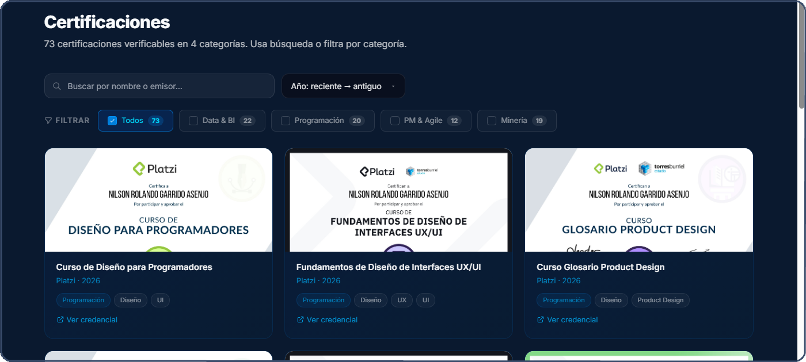

# Nilson Rolando Garrido Asenjo

**Mining Engineer · Industrial Manager · Data Analyst**

Ingeniero de Minas egresado en primer puesto (UNC) y Administrador Industrial (SENATI), con enfoque en analítica de datos, automatización de procesos y gestión de operaciones mineras. Experiencia en gran minería (Newmont Yanacocha, Gold Fields, Silver Mountain, Chinalco, Rio Tinto), piloto/operador RPAS acreditado por la DGAC (Perú) y desarrollo de plataformas digitales para la industria minera.

---

## Algunos logros

<table>
<tr><td width="220"><b>Chinalco · Proyecto Toromocho</b></td><td>Lideré la auditoría y reconciliación de mineral: GPS de flota + modelos de bloques + Minestar → 8 ratios reportados en Power BI.</td></tr>
<tr><td><b>Silver Mountain · Mina Reliquias</b></td><td>Piloteé un dron a +4,500 msnm documentando la evolución constructiva de infraestructura crítica, sin incidentes de seguridad.</td></tr>
<tr><td><b>CODEa UNI</b></td><td>Hice crecer el equipo de 3 a 16 personas como Jefe de Proyectos — ganador de Startup Perú 11G y Acelera 3G, bootcamps oficializados por el MINEM.</td></tr>
<tr><td><b>Rio Tinto · Proyecto Mara</b></td><td>Supervisé el mapeo LiDAR con dron Elios 3 de labores subterráneas artesanales, sin exponer personal a riesgo de ingreso.</td></tr>
</table>

---

## Lo que encontrarás en mi portafolio

**[nrgarridoa.github.io](https://nrgarridoa.github.io)**

### Proyectos

Dashboards interactivos, herramientas de análisis y soluciones data-driven aplicadas a operaciones mineras — Power BI, Python, Machine Learning.

### Artículos técnicos

Tutoriales reproducibles con código, datos y notebooks. Desde clasificar mineral y estéril con regresión logística hasta predecir vibraciones por voladura con Scikit-learn.

### CV interactivo

+10 años de experiencia, 7 empresas, formación académica, certificaciones verificables y desarrollo profesional.

### Certificaciones

73+ certificaciones verificables en Data & BI, Programación, Project Management, Agile y Minería — Platzi, Coursera, iSE-Latam, Netzun.

---

## Stack principal

---

## Contacto

---

MIT License
